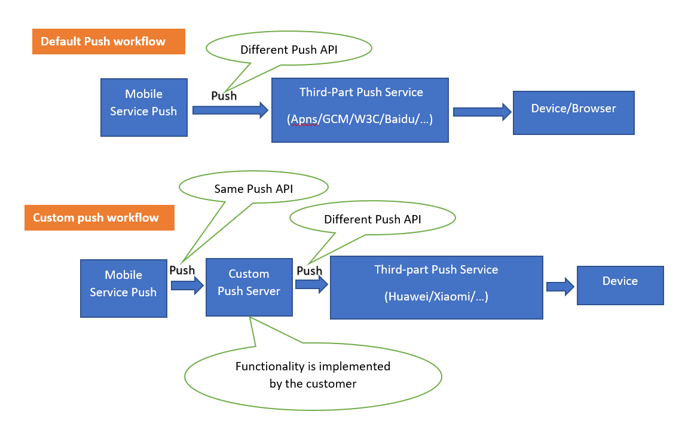

## Custom Push Server Sample

## Table of Contents
 * [Description](#description)
 * [Requirements](#requirements)
 * [Download and Installation](#download-and-installation)
 * [How to Use](#how-to-use)
 * [Known Issues](#known-issues)
 * [How to obtain support](#how-to-obtain-support)
 * [Contributing](#contributing)
 * [Knowledge base](#knowledge-base)
 * [License](#license)

## Description
This project is the sample code of Custom Push Server, it is based on Spring Boot Starter, it uses Maven as the build management tool.

The Custom Push Server works with the SAP Cloud Platform Mobile Services and can supports pushing messages to devices, which must be integrated with Mobile Services to use. It can support many third-party push providers, such as Huawei Push, Xiaomi Push.

Most of the third-party push providers have different Push APIs. SAP Mobile Service does not want to integrate them directly, so we create the Custom Push Server. It acts as an Adapter between the Mobile Service push service and the third-party push providers.

The Custom Push has a REST API that accepts push messages from Mobile Service, transforms the request data according to third-party provider's API, and then call the third-party push provider's API to push the messages to the device.

This diagram shows the difference between the Default Push workflow and the Custom Push workflow:


## Requirements
 * JDK 8.0 or later
 * SpringBoot 2.3 or later
 * Maven 3.5 or later
 * HMS Pushkit Java Severdemo, v1.0
 * MiPush SDK Server Http2, v1.0.9

## Download and Installation

##### Download and configuration
Download the source code from this repository, save it to a local folder, then make the following changes:

* Update [application.yml](src/main/resources/application.yml)

```
spring:
  security:
    user:
      name: <username>
      password: <please-change-it>
```

Change the `<username>` and `<please-change-it>`, the new username and password are used for `BASIC` authorization of the Push API.

* Update [config.properties](src/main/resources/config.properties)

```
#Define which push provider is enabled, currently valid providers: HUAWEI, XIAOMI
active_push_provider=

#HUAWEI PUSH configurations
huawei_push_open_url=https://push-api.cloud.huawei.com
huawei_token_server=https://oauth-login.cloud.huawei.com/oauth2/v2/token
huawei_app_id=
huawei_app_secret=

#XIAOMI PUSH configurations
xiaomi_app_package_name=
xiaomi_app_secret_key=
```
The `active_push_provider` must be set, only one provider can be set to active, currently the sample code can support `HUAWEI` provider and `XIAOMI` provider, you can add additional providers by adding new implementation code.

If set `HUAWEI` as active provider, the following parameters must be set, please refer to Huawei push API documentation for more details.
 - `huawei_push_open_url`
 - `huawei_token_server`
 - `huawei_app_id`
 - `huawei_app_secret`

If set `XIAOMI` as active provider, the following parameters must be set,please refer to Xiaomi push API documentation for more details.
 - `xiaomi_app_package_name`
 - `xiaomi_app_secret_key`

##### Build and startup
Using Maven as the build management tool.
 * Register [MiPush_SDK_Server_Http2_1.0.9.jar](lib/MiPush_SDK_Server_Http2_1.0.9.jar) to local Maven repository, run command in base directory:

 ```
mvn install:install-file -Dfile=lib/MiPush_SDK_Server_Http2_1.0.9.jar -DgroupId=com.xiaomi.miliao -DartifactId=xmpush-server-api-http2 -Dversion=1.0.9 -Dpackaging=jar
 ```

 * Build project, run command in base directory: 

```
mvn clean install
```

 * Start up application, upload the jar generated from the target folder to the Cloud Platform and start the application through the cloud command, or move the generated JAR to the on-premise server and run the command to start the application server:

```
java -jar <path-and-filename-to-the-target-jar-file>
```
`<path-and-filename-to-the-target-jar-file>` is the path to the generated jar file name, such as `target/custom-push-0.0.1-SNAPSHOT.jar`.

For information on how to start the application server as a background process, you can refer to the OS's help documentation.

##### Push API definition reference
Refer to **[custom-push-api.yml](custom-push-api.yml)** for more details.

Place holders description:
 - `<custom.push.server.host>`: the Custom Push server host, it depends on the deployed cloud platform or the host of on-premise server.
 - `<push>`: the Custom Push API end point, it can be changed in source code, the default value in sample code is 'push'.
 
## How to Use
After the 'Custom Push Server' is deployed and running, you can do the following steps to use the Custom Push Server.
1. Create an application in SAP Cloud Platform Mobile Services Cloud Foundry Landscape.
2. Add 'Mobile Push Notification' and 'Mobile Connectivity' features to the application.
3. Create a 'Mobile Destination' in 'Mobile Connectivity' feature, point to the 'Custom Push Server'.
4. Configure 'Custom Push' in 'Mobile Push Notification', set this mobile destination in 'Custom Push Destination'.
5. Register push devices using client application in mobile device or emulator.
6. Send push notifications to devices using the Mobile Services Push API.

For more information please refer to the product page and the guides of SAP Cloud Platform Mobile Services.

## Known Issues
A list of known issues is available on the GitHub issues page of this repository.

## How to obtain support
If you have issues with a sample, please open a report using [GitHub issues](https://github.com/SAP-samples/cloud-platform-mobile-custom-push-provider/issues).

## Contributing
This project is only updated by SAP employees.

## Knowledge base
 * [Product page](https://help.sap.com/viewer/product/SAP_CLOUD_PLATFORM_MOBILE_SERVICES/Cloud/en-US) of SAP Cloud Platform Mobile Services
 * [Guides](https://help.sap.com/doc/f53c64b93e5140918d676b927a3cd65b/Cloud/en-US/docs-en/guides/index.html) of SAP Cloud Platform Mobile Services

## License
Copyright (c) 2020 SAP SE or an SAP affiliate company. All rights reserved. This project is licensed under the Apache Software License, version 2.0 except as noted otherwise in the [LICENSE](LICENSES/Apache-2.0.txt) file.
