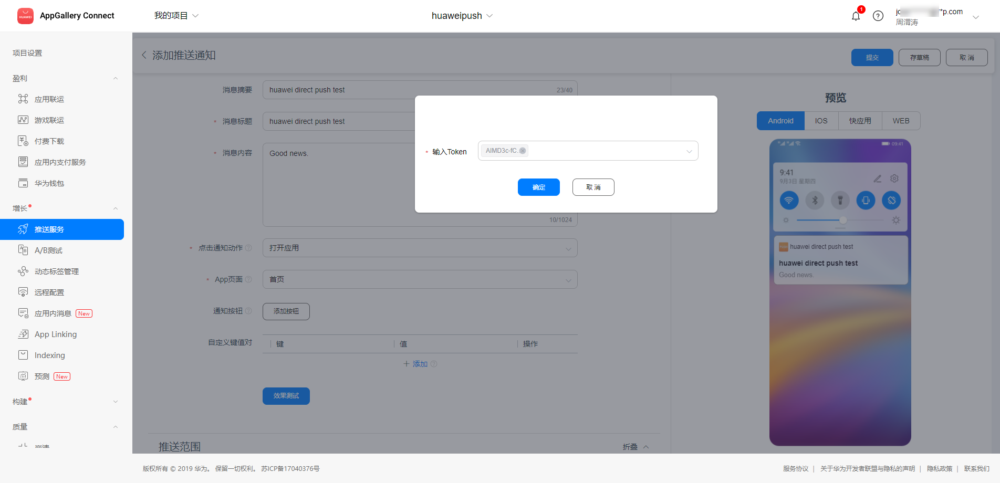

# Push Kit sample code for Android

## Table of Contents

 * [Introduction](#introduction)
 * [Getting Started](#getting-started)
 * [Installation](#installation)
 * [Supported Environment](#supported-environment)
 * [Hardware Requirements](#hardware-requirements)
 * [License](#license)

## Introduction
In this Demo, you will use the Demo Project that has been created for you to call HUAWEI Push Kit APIs. Through the Demo Project, you will:
1. Apply for a token from HUAWEI Push Kit.
2. Register the app to SAP cloud foundary mobile service
3. Register this device to SAP CF mobile push service
4. Receive notification/data messages from HUAWEI Push Kit. 
5. Receive notification/data messages from SAP 

For more information, please refer to: https://developer.huawei.com/consumer/en/doc/development/HMS-Guides/push-introduction

## Getting Started
1. Register as a developer.
Register a [HUAWEI account](https://developer.huawei.com/consumer/en/doc/start/10104).
2. Create an app and enable APIs. The package name is recommended to use real package name. You may need to enable [AppGallery Connect and Push service](https://developer.huawei.com/consumer/cn/console#/serviceCards/) at Huawei account.
3. To build this demo, please first import the demo to Android Studio (3.X or later). Then download the agconnect-services.json file of the app from AppGallery Connect, and add the file to the app directory (\app) of the demo. A sample copy is provided and named agconnect-services.json.sample.
You should also generate a signing certificate fingerprint and add the certificate file to the project, and add configuration to build.gradle.
     For details, please refer to [Preparations for Integrating HUAWEI HMS Core](https://developer.huawei.com/consumer/en/codelab/HMSPreparation/index.html)
4. Or Build a new demo. 
Please follow this doc, [HMS Toolkit - Automatic HMS SDK Integration](https://forums.developer.huawei.com/forumPortal/en/topicview?tid=0201249144855100206&fid=0101188387844930001). 

## Installation
To use functions provided by examples, please debug on android device by one of the 3 ways.

1, Please make sure Huawei Mobile Service 4.0 or later has been installed on your
cellphone. You can compile and build the codes in Android Studio. After
building the APK, you can install it on the phone and debug it. Or
generate the APK file from Android Studio. Use the ADB tool to install
the APK on the phone and debug it. Run "adb install
{YourPath}\\{ThisApp}\app\build\outputs\apk\debug\app-debug.apk"

2, Use Huawei cloud debugging via android studio. Follow this doc,
[Debug your application on any HMS Supported Model using HMS Toolkit Cloud Debugger - No Real Device Required](https://forums.developer.huawei.com/forumPortal/en/topicview?tid=0201336709130540054&fid=0101188387844930001).
This is preferred.

3, Use Huawei cloud debugging via browser. Follow this doc,
[Debugging an App on a Real Device in Real Time](https://developer.huawei.com/consumer/en/doc/development/AppGallery-connect-Guides/agc-clouddebug-realtimedebug)

## Run
Prepare the server side components
- Install a custom push server for huawei. Server URL ends with "/push".

- Create a mobile application, testCustomPushHuawei, with "Mobile Connectivity" and "Mobile Push Notification" services.

- Bind custom push server for huawei as a mobile destination. 

Run this demo app on Huawei cloud debugging platform. 
- At HMS->Cloud Debugging, click Available Devices to filter. Select an EMUI 10.0.1 device to start.

- Install the app
- Click Get Token to get a huawei push token. We need this token to test push message for huawei cloud messaging tool.

- Click Register CF. Login to SAP cloud foundry mobile service app with valid username and password. Once login is done, it will return to Andrid app

- Register Device. Register this device to SAP mobile application. 

- Send test message from SAP Mobile Push Notification. 

- Send advanced msg from SAP Mobile Push Notification.

- Get above 2 messages in Android device

- Send push message from Huawei Push Service

- Get above message in Android device

## Supported Environment
Android SDK Version >= 23 and JDK version >= 1.8 is recommended.

## Hardware Requirements
A computer (desktop or laptop) that runs the Windows 10/Windows 7 operating system
A Huawei mobile phone with a USB cable, to be used for service debugging

## Question or issues
If you want to evaluate more about HMS Core,
[r/HMSCore on Reddit](https://www.reddit.com/r/HuaweiDevelopers/) is for you to keep up with latest news about HMS Core, and to exchange insights with other developers.

If you have questions about how to use HMS samples, try the following options:
- [Stack Overflow](https://stackoverflow.com/questions/tagged/huawei-mobile-services) is the best place for any programming questions. Be sure to tag your question with 
`huawei-mobile-services`.
- [Huawei Developer Forum](https://forums.developer.huawei.com/forumPortal/en/home?fid=0101187876626530001) HMS Core Module is great for general questions, or seeking recommendations and opinions.

If you run into a bug in our samples, please submit an [issue](https://github.com/HMS-Core/hms-push-clientdemo-android/issues) to the Repository. Even better you can submit a [Pull Request](https://github.com/HMS-Core/hms-push-clientdemo-android/pulls) with a fix.

## License
Push kit sample code for android is licensed under the [Apache License, version 2.0](http://www.apache.org/licenses/LICENSE-2.0).
