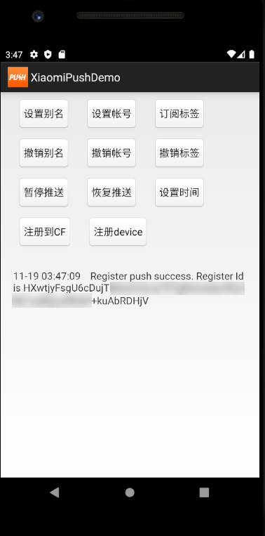

# PushDemo4Studio-XiaoMi

## Table of Contents
 * [Introduction](#introduction)
 * [Depends on](#depends-on)
 * [Run](#Run)

## Introduction
 * It's a demo maven project which will call XiaoMi Push with Xiaomi client SDK to send request to Xiaomi Push server to do such as register, set alias, set topic, set account and so on.

## Depends on
+ JDK 8.0 or later.
+ Client SDK MiPush\_SDK\_Client\_3\_8\_2.jar.
+ SAP-CP-SDK-for-Android-3.2.0

## Run
   - 1 Setup client side: Android App

   - 1.1 Login to Mi Dev platform https://admin.xmpush.xiaomi.com/

   - 1.1.1 register the app and remember the AppID, AppKey and AppSecret.

The AppID and AppKey are the client's identity, used when the client SDK initializes; the
AppSecret is authenticated for sending message at server side. (Extracted from Mi Doc.)
  
  
  

   - 1.1.2 Enable to use Mi Push

   

   - 1.1.3 Download client sdk and demo to create your own Android app.
      Client sdk and demo download from:
 https://admin.xmpush.xiaomi.com/zh_CN/mipush/downpage?version=2020092703&appId=2882303761518744922
      Download updated demoapp related to my sample app XiaoMiPushTestApp from https://github.com/SAP-samples/cloud-platform-mobile-custom-push-provider/tree/master/xiaomi-push-clientdemo-android

   - 1.1.4 Downloaded and Installed version 3.2.0 of the SAP Cloud Platform SDK for Android.
       Download URL: https://developers.sap.com/trials-downloads.html?search=sdk%20for%20android
       Unzip the downloaded zip file to your local folder.
       Copy the file foundation-3.2.0.aar from your local folder just unziped %user%\SAP-CP-SDK-for-Android-3.2.0\m2repository\com\sap\cloud\android\foundation\3.2.0 to the libs folder of your android project.
       Installed guide: https://help.sap.com/doc/f53c64b93e5140918d676b927a3cd65b/Cloud/en-US/docs-en/guides/getting-started/android/setup.html
   - 1.1.5 Run the android app to get register id

   - 2 Configure server side:

   - 2.1 Download Custom Push Server from https://github.com/SAP-samples/cloud-platform-mobile-custom-push-provider/tree/master/custom-push-server-sample-java.

   - 2.2 Update file %CustomPushServer%\src\main\resources\application.yml to provide the user name and password you want. also need to update the %CustomPushServer%\src\main\resources\config.properties according to the README.MD underthe folder.

   - 2.3 Run according to the README.MD under the folder.

   - 2.4 Remember the service url for later use to create proxy endpoint, such as https://custom-push-xiaomidemo.cfapps.sap.hana.ondemand.com/.

Make sure to add "/push" at the end of the url for proxy endpoint

   

   

   - 2.5 Create app with proxy and push services

   

   - 2.6 Update app proxy to add endpoint with deployed custom push service

   

{
  "parameters": {
    "endpointConfigurations": [
      {
        "endPointName": "custom.push.proxy",
        "endPointAddress": "https://custom-push-xiaomidemo.cfapps.sap.hana.ondemand.com/push",
        "useCloudConnector": false,
        "maximumConnections": 32,
        "maxRequestSizeInBytes": 1000000,
        "connectionTimeout": 180000,
        "throttlingThreshold": -1,
        "propagateUsername": false,
        "virusScanType": "None",
        "rewriteMode": "IN_ODP",
        "ssoMethod": "BASIC",
        "basicAuthentication": {
          "userName": "admin",
          "password": "pass$1"
        }
      }
    ]
  }
}

   

   - 2.7 Register device
   In android app, click on button "注册到CF" to onboard on the CF app.

   
   It will invoke the logon window. Fill in with correct user name and password.
   
   Then the app will switch back to main window.
   Click on button "注册device" to register the device to the CF app.

   - 2.8 Send message
   Go to CF Microservice Admin UI. Select the application and switch to push service. Go to Push Registration tab. You will see the newly added register in the list.
   Click on Send Notification button of the newly registed item to invoke Send Push Notification window.

Switch to Advanced tab and fill in the body as following

  

{
  "alert": "Alert message",
  "badge": 1,
  "data": "{'product':'computer','count':'100'}",
  "priority": "high",
  "sound": "DefaultNotificationSound",
  "custom": {
    "title": "The title for the app",
    "body": "The notification message",
    "description": "This is for xiaomi push test"
  },
  "customParameters": {
    "gcm.badge": 2
  }
}

You can send message again with updated message.

Then in client side, you will see the message in your device.

For xiaomi push, it's recommended to test with real device. It will be more stable.

   

